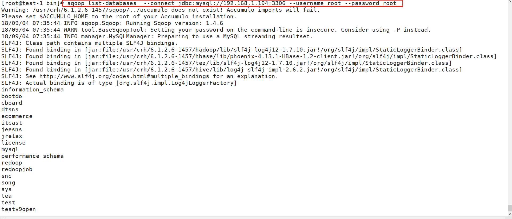
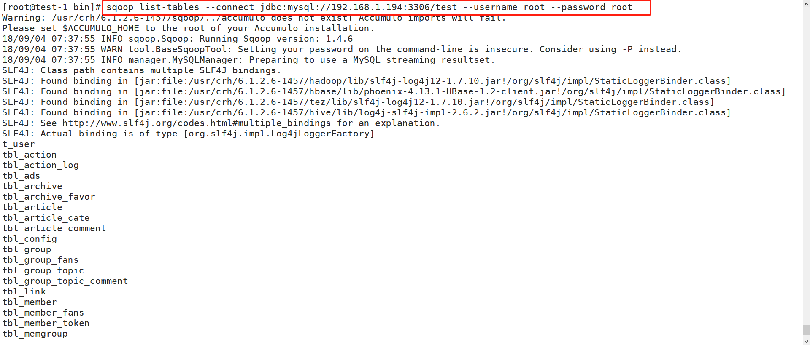
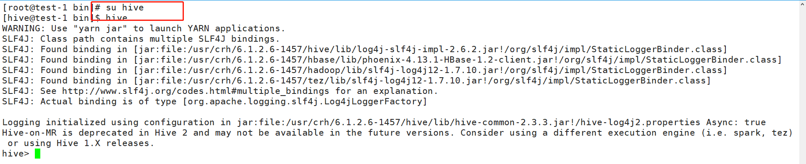
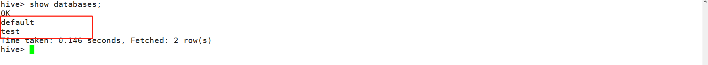
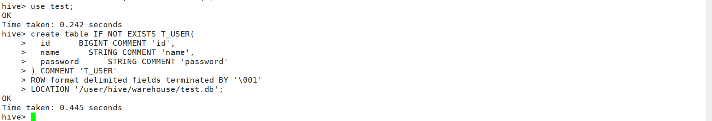
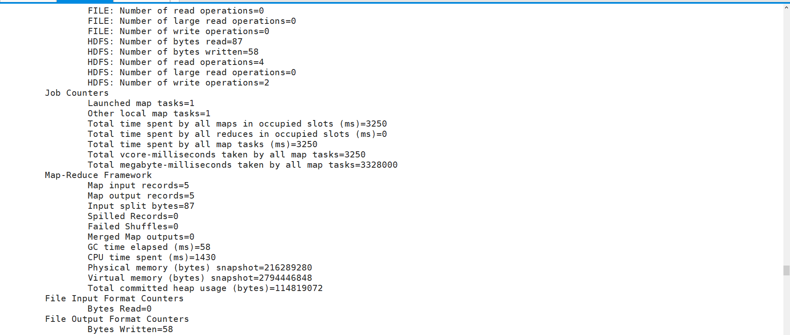
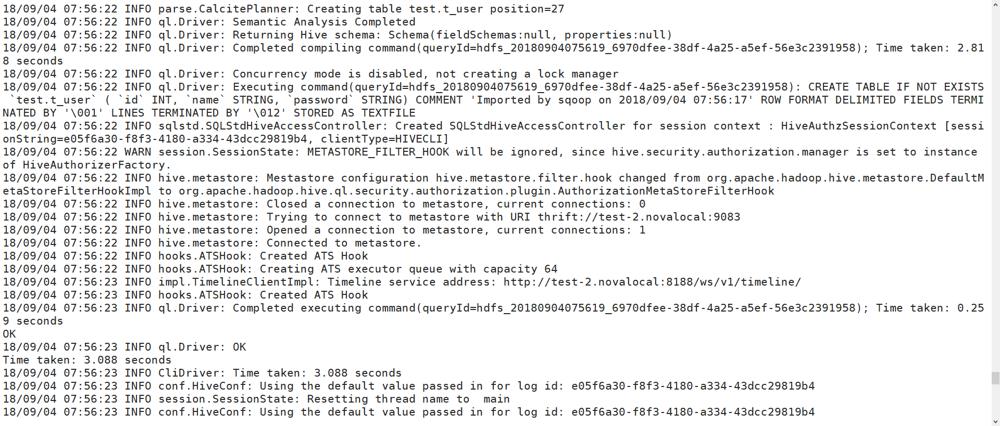

# Sqoop使用文档

##	1.Sqoop简介
	Sqoop用于Hadoop和关系数据库或者大型机之间数据传输的工具。可以使用Sqoop将数据从关系数据库（MYSQL、Oracle）导入至Hadoop（HDFS）中，转换为HadoopMapReduce中的数据。
	
	Sqoop自动执行此过程的大部分过程，依靠数据库来描述要导入的数据的模式。Sqoop使用MapReduce导入和导出数据，提供并行操作和容错。
	
## 2.Sqoop须知
	1.如果从MySQL或者Oracle中导数据需要安装MySQL和Oracle driver。
	2.解压下载后的jar包放入sqoop目录下的lib下
	

	

## 3. sqoop命令

		

## 4.Soop-import
### 4.1 sqoop-import将单个表导入HDFS。
#### 4.1.1常见参数		
	表中的每一行都表示为HDFS中的单独记录。记录可以存储为文本文件(每行一个记录)。

| 语法    | 参数    |
| --- | --- |
| --connect <jdbc-uri> | 指定JDBC连接字符串  |
| --connection-manager <class-name>    |  指定要使用的连接管理器类   |
|   --driver <class-name>  | 手动指定要使用的JDBC驱动程序类    |
|   --hadoop-mapred-home <dir>  |  覆盖$ HADOOP_MAPRED_HOME   |
|   --help  |  使用说明   |
| --password-file    |  设置包含验证密码的文件的路径   |
|-- P   |  从控制台读取密码   |
| --password <password>    | 设置验证密码    |
| --username <username>     |	设置认证用户名     |
| --verbose    |    打印更多信息 |
|  --connection-param-file <filename>	 |    提供连接参数的可选属性文件   |
|  --relaxed-isolation   | 将连接事务隔离设置为读取未提交的映射器。
    
#### 4.1.2  连接数据库

       Sqoop旨在将数据库中的表导入HDFS。为此，您必须指定一个描述如何连接到数据库的连接字符串。该连接字符串是类似于URL，并连通到到Sqoop --connect说法。这描述了要连接的服务器和数据库; 它也可以指定端口。例如：

`sqoop import --connect jdbc:mysql://192.168.1.194:3306/test
   --username root --password root`
   
   	此链接是连接192.168.1.194主机上MySQL数据库test，用户为root，密码为root。如果使用Sqoop与分布式Hadoop集群。您提供的连接字符串将用于整个MapReduce集群中的TaskTracker节点; 如果指定文字名称localhost，则每个节点将连接到不同的数据库（或者更可能是根本没有数据库）。相反，您应该使用所有远程节点都可以看到的数据库主机的完整主机名或IP地址。
	
  

### 4.2将数据导入至Hive中
#### 4.2.1Hive参数
		

|   参数  | 描述    |
| --- | --- |
|  --hive-home <dir>   |   覆盖 $HIVE_HOME  |
|  --hive-import   |  将表导入Hive（如果没有设置，则使用Hive的默认分隔符。）   |
|  --hive-overwrite   | 覆盖Hive表中的现有数据。    |
| --create-hive-table    | 如果设置，则作业将失败，如果目标配置单元表退出。默认情况下，此属性为false     |
|--hive-table <table-name>    |   	设置导入Hive时要使用的表名  |
|  --hive-drop-import-delims   |  导入到Hive时从字符串字段中 删除\ n，\ r和\ 01   |
| --hive-delims-replacement    |   导入到Hive时，使用用户定义的字符串 替换字符串字段中的\ n，\ r和\ 01  |
|  --hive-partition-key   | 分区的配置单元字段的名称是分片的    |
| --hive-partition-value <v>    |字符串值，用作此作业中导入到配置单元的分区键     |
| --map-column-hive <map>    |   覆盖已配置列的SQL类型到Hive类型的默认映射  |

#### 4.2.2将数据导入Hive

	Sqoop主要功能是将数据传入HDFS中。如果有一个与HDFS集群关联的Hive Metastore，Sqoop还可以通过生成并执行CREATE TABLE语句来将数据导入Hive，以在Hive中定义数据的使用。（-hive-import）
	如果hive中标已经存在，则可以指定-hive-overwrite替换已经存在的表，将数据导入HDFS，sqoop生成hive脚本，包含create table使用hive类型定义列的操作，以及一个LOAD DATA INPATH 将数据文件移动到Hive仓库目录的语句。
	该脚本通过CRH--sqoop调用已安装的配置单元执行，如果集群或者单节点有多个hive，则可以指定hive版本进行操作
`$PATH  --hive-home 选项来识别Hive安装目录及版本 Sqoop $HIVE_HOME/bin/hive`

 或者
   
  `sqoop import --connect jdbc:mysql://<dburi>/<dbname> --username <username> --password <password> --table <tablename> --check-column <col> --incremental <mode> --last-value <value> --target-dir <hdfs-dir>`
	
	参数说明：

	dburi：数据库的访问连接，例如： jdbc:mysql://192.168.1.124:3306/ 如果您的访问连接中含有参数,那么请用单引号将整个连接包裹住，例如’jdbc:mysql://192.168.1.124:3306/mydatabase?useUnicode=true’

	dbname：数据库的名字，例如：user。

	username：数据库登录用户名。

	password：用户对应的密码。

	tablename：MySQL 表的名字。

	col：要检查的列的名称。

	mode：该模式决定Sqoop如何定义哪些行为新的行。取值为append或lastmodified。

	value：前一个导入中检查列的最大值。

	hdfs-dir：HDFS 的写入目录，例如：/user/hive/result。

### 4.3将数据导入至Hbase中
#### 4.3.1Hbase参数

| 参数    | 描述    |
| --- | --- |
|   --column-family <family>  |  设置导入的目标列   |
|  --hbase-create-table   |  如果指定，则创建缺少的HBase表   |
|   --hbase-table <table-name>  | 指定表，而不是HDFS的HBase表    |
|  --hbase-bulkload   | 启动批量加载    |

#### 4.3.2数据导入至Hbase
	Sqoop支持除HDFS和Hive之外的其他导入目标。Sqoop也可以将记录导入HBase中的表：
	
	 通过指定--hbase-table，Sqoop导入HBase中的表而不是HDFS中的目录。Sqoop会将数据导入到指定为参数的表中--hbase-table。输入表的每一行将转换为HBase Put操作到输出表的一行。每行的键取自输入的一列。默认情况下，Sqoop将使用拆分列作为行键列。如果未指定，则会识别源表的主键列(前提有源表);也可以手动指定行键列--hbase-row-key。每个输出列将放在同一列组中，必须使用该列组指定--column-family；语句：
`sqoop import --connect jdbc:mysql://192.168.1.194:3306/test --username root --password root --table test --hbase-table test --column-family id --hbase-row-key id`

## 5.sqoop操作(以mysql为例)
### MySQL信息
	mysql为我本地MySQL，如果需要linux下MySQL，则部署安装即可。
	本地MySQL信息如下
		用户：root
		密码：root
		连接IP：192.168.1.194:3306
		测试库：test
		测试表：test

### 测试mysql连接
	查看mysql的数据库
	sqoop list-databases  --connect jdbc:mysql://192.168.1.194:3306 --username root --password root		

	查看mysql其中一个库中的表
	sqoop list-tables --connect jdbc:mysql://192.168.1.194:3306/test --username root --password root
				

### 	Sqoop导入Mysql数据到Hive

	切换为hive用户
		su hive
		hive

	创建hive库和表
	
		create database test;
		show databases;
		ues test;
			
	创建表并指定hdfs存放路径'/user/hive/warehouse/test.db'
		create table IF NOT EXISTS T_USER(
			  id      BIGINT COMMENT 'id',
			  name      STRING COMMENT 'name',
			  password      STRING COMMENT 'password'
			) COMMENT 'T_USER'
			ROW format delimited fields terminated BY '\001' 
			LOCATION '/user/hive/warehouse/test.db';
			
	  default库为系统默认的数据库;test为所创建的数据库。

		

			
	Sqoop从MySQL导入数据进入Hive		
	sqoop import -m 1 --connect jdbc:mysql://192.168.1.194:3306/test --username  root --password root --table t_user --hive-import --hive-overwrite --hive-table hivetest.t_user --hive-drop-import-delims
			

	
	进入hive查询test库下的t_user表
	select * from t_user;

至此，Sqoop从MySQL导数据进入Hive完成。
